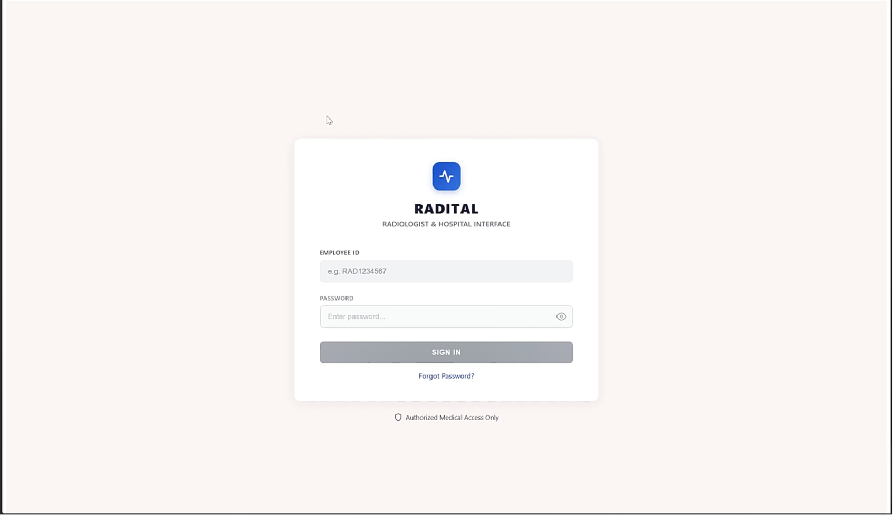
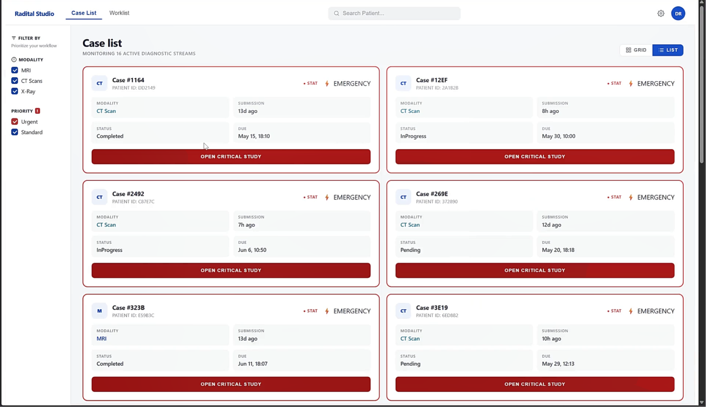
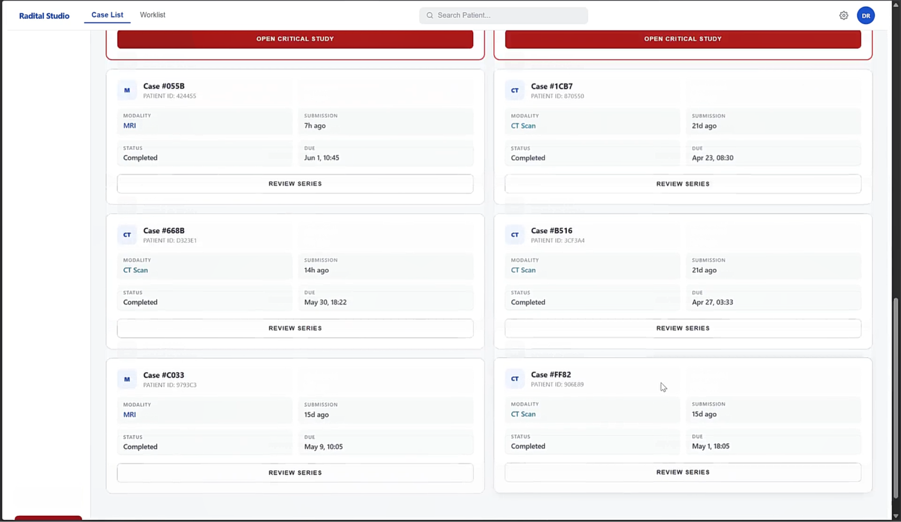
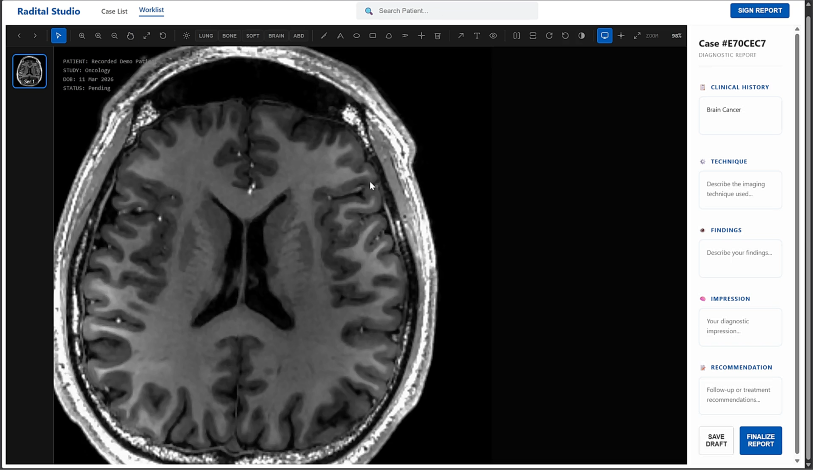
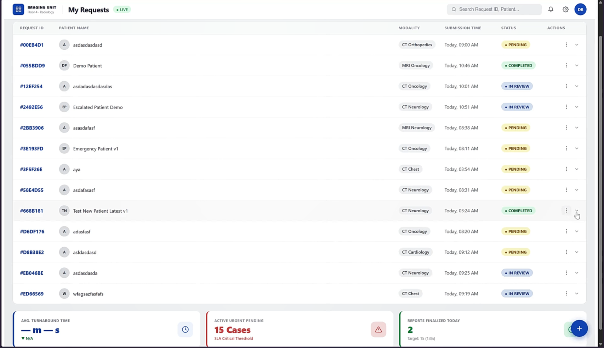
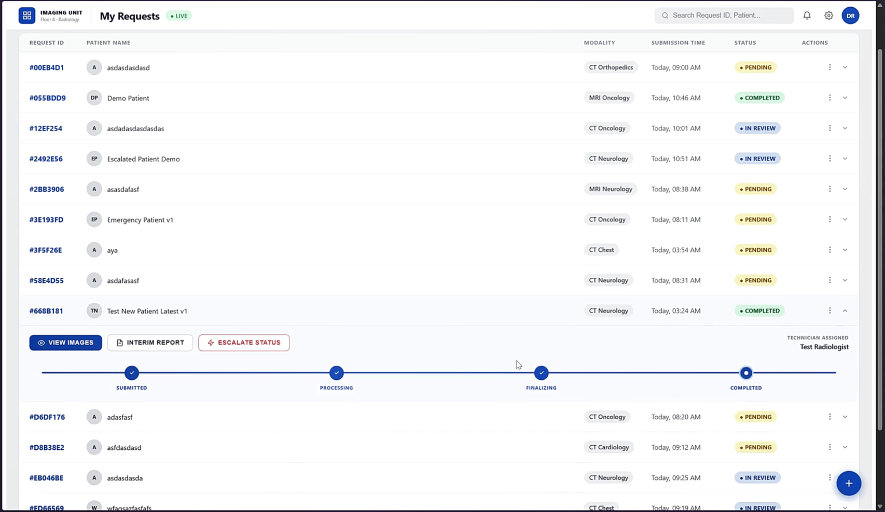
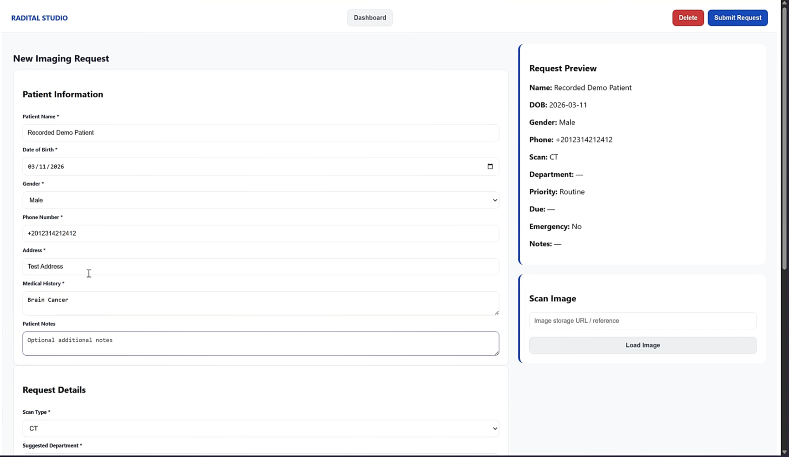
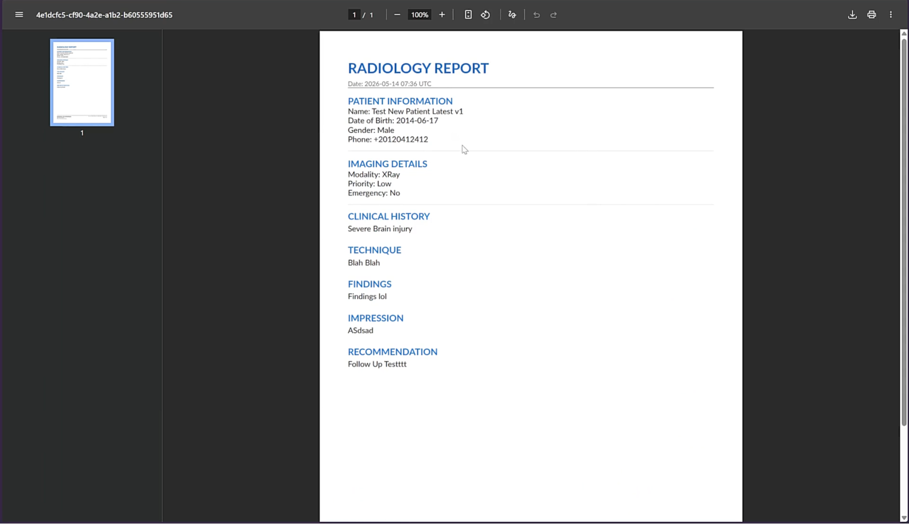

<div align="center">


<h1>🏥 RADITAL</h1>
<h3>Radiology Remote Consultation Platform</h3>

<p><em>Connecting hospital imaging centers with specialized radiologists — faster, smarter, and in full compliance with international health data standards.</em></p>

[](LICENSE)
[](CHANGELOG.md)
[]()
[]()
[]()

</div>

---

## 📋 Table of Contents

- [The Problem](#-the-problem)
- [The Solution](#-the-solution)
- [Live Demo](#-live-demo)
- [Screenshots](#-screenshots)
- [Architecture](#️-architecture)
- [Software Engineering Process](#-software-engineering-process)
- [Technical Stack](#️-technical-stack)
- [User Stories & Epics](#-user-stories--epics)
- [Release Plan](#-release-plan)
- [Testing](#-testing)
- [Security](#-security)
- [Team](#-team)

---

## 🔴 The Problem

Hospitals in underserved or remote regions face a critical bottleneck: **radiology is centralized, but patients are not.**

A hospital technician captures a high-resolution CT scan of a trauma patient at 2 AM. The nearest radiologist is 200 km away. Emailing a 500 MB DICOM file over unsecured channels isn't HIPAA-compliant. Calling for a verbal consult is inaccurate and unauditable. The patient waits.

**Key pain points:**
- 🔴 No standardized, secure channel for remote radiology consultation
- 🔴 No emergency prioritization — urgent cases queue behind routine ones
- 🔴 No intelligent case routing — wrong specialist gets the scan
- 🔴 No integrated viewing tools — radiologists download massive files
- 🔴 No audit trail — untrackable, non-compliant workflows

---

## ✅ The Solution

**RADITAL** is a dual-sided SaaS platform that digitizes the full remote radiology consultation lifecycle:

```
Hospital Technician              RADITAL Platform              Radiologist
──────────────────               ───────────────               ───────────
Submit imaging request  →→→  Encrypt & route case  →→→  View in dashboard
Upload DICOM securely   →→→  Match to best doctor  →→→  Open in browser viewer
Flag as Emergency/STAT  →→→  Bypass queue, alert   →→→  Dictate findings
Track real-time status  ←←←  Finalize & notify     ←←←  Submit report
```

**What makes RADITAL different:**
- ⚡ **5-minute SLA** — emergency cases auto-escalate if not accepted
- 🧠 **Match Score Engine** — AI-driven specialist routing based on specialty, queue size & turnaround time
- 🔒 **End-to-end encryption** — AES-256 at rest, TLS 1.3 in transit, HIPAA/GDPR compliant
- 🖥️ **Zero-install DICOM viewer** — full diagnostic tools in the browser
- 📊 **Real-time everything** — WebSocket-powered status tracking across all roles

---

## 🎬 Live Demo

> **📹 Demo Video:** [Watch Full Platform Walkthrough](#) *(add your video link here)*

> **🌐 Live Preview:** [radital.app](#) *(add your deployment link here)*

---

## 📸 Screenshots

### Login Page — Role Selection

> The entry point routes users to their specialized clinical workspace. The routing happens based on the login ID whether it starts with TEC or RAD


*(See Phase 3/4 Report — UI/UX Designs, Page 15)*

---

### Radiologist Dashboard — Case List (A.2)

> Prioritized case queue with STAT cases pinned at top with red emergency banners. Filter by modality and priority in real time.




**Key features visible:**
- 🔴 STAT/Emergency cases with red banners and `OPEN CRITICAL STUDY` CTA
- 📋 Case cards: Patient ID, Modality, Submission time, Status
- 🔍 Modality & Priority filter sidebar
- 🔔 Notification bar for new urgent MRI arrivals with ACKNOWLEDGE action

---

### DICOM Viewer & Report Authoring (A.3)

> Full diagnostic workspace: browser-based DICOM viewer with annotation tools side-by-side with the structured report template.



**Tools available:**
| Tool | Capability |
|------|-----------|
| 🔬 Zoom | Scroll-wheel zoom, pinch-to-zoom on touch |
| ✋ Pan | Click-and-drag pan |
| 📏 Measure | Calibrated distance tool (±1mm accuracy from DICOM metadata) |
| 🌗 W/L Contrast | Lung Window, Bone Window, Soft Tissue presets |
| 🎙️ Dictation | Voice-to-text with ≥95% medical terminology accuracy |
| 🔄 Reset | Return to default view state |

---

### Medical Staff — Requests Dashboard (B.2)

> Real-time request tracking for hospital technicians with color-coded status badges and workflow progress indicators.





**Status colors:** 🟡 Pending → 🔵 In Review → 🟢 Completed

---

### Create Imaging Request & Emergency Case (B.3 / B.4)

> Multi-step request form with patient demographics, DICOM upload, modality selection, and Emergency/STAT toggle with mandatory clinical justification.




### Report Delivery (B.3 / B.4)

> The final report delivered by the radiologist

---

## 🏛️ Architecture

### System Architecture Diagram

> *(Phase 3/4 Report — Architecture Overview, Page 11)*

```
┌─────────────────────────────────────────────────────────────┐
│                    PRESENTATION LAYER                        │
│  ┌──────────────────┐  ┌───────────────┐  ┌─────────────┐  │
│  │ Physician /      │  │  Radiologist  │  │   Admin /   │  │
│  │ Technician Portal│  │   Dashboard   │  │  Manager    │  │
│  └──────────────────┘  └───────────────┘  └─────────────┘  │
│          React.js SPA — REST + WebSocket                    │
└──────────────────────────┬──────────────────────────────────┘
                           │
┌──────────────────────────▼──────────────────────────────────┐
│                      API GATEWAY                            │
│   JWT Auth · RBAC · Rate Limiting · TLS Termination         │
└──┬──────────┬──────────┬──────────┬──────────┬─────────────┘
   │          │          │          │          │
┌──▼──┐  ┌───▼───┐  ┌───▼───┐  ┌──▼──┐  ┌───▼────┐
│Req. │  │Match  │  │Escal- │  │Rpt. │  │User &  │
│Mgmt │  │Engine │  │ation  │  │Svc  │  │Auth    │
│Svc  │  │       │  │Svc    │  │     │  │Svc     │
└──┬──┘  └───┬───┘  └───┬───┘  └──┬──┘  └───┬────┘
   │          │          │          │          │
┌──▼──────────▼──────────▼──────────▼──────────▼─────────────┐
│                      DATA LAYER                             │
│  ┌─────────────────────────┐  ┌────────────────────────┐   │
│  │  PostgreSQL             │  │  DICOM / Object Store  │   │
│  │  (cases, reports, audit)│  │  (AWS S3 + PACS)       │   │
│  └─────────────────────────┘  └────────────────────────┘   │
│              Redis Cache (Match Score / Queue)              │
└─────────────────────────────────────────────────────────────┘
```

### Use Case Diagram

> *(Phase 3/4 Report — Page 1)*

Three primary actors interact with the Radital System Workflow:

| Actor | Primary Use Cases |
|-------|------------------|
| **Nurse / Medical Staff** | Create Imaging Request, Track Request Status, View Case Dashboard |
| **Radiologist** | Submit Report, Voice Dictation, Open Browser Viewer, Perform Image Analysis, Update Profile, Toggle Availability |
| **Technician (Imaging Center)** | Secure DICOM Upload, Flag as Emergency/STAT |

Key UML relationships:
- `Create New Imaging Request` **«include»** `Enter Patient Demographics`
- `Create New Imaging Request` **«extend»** `Track Request Status`
- `View Case Dashboard` **«include»** `Specify Scan Type`
- `Submit Report` **«include»** `Use Standard Template`
- `Voice Dictation` **«extend»** `Submit Report`
- `Open Browser Viewer` (Radiologist)
- `Perform Image Analysis` **«include»** `Use Diagnostic Tools`
- `Secure DICOM Upload` **«include»** (Technician)
- `Secure DICOM Upload` **«extend»** `Flag as Emergency/STAT`

### Key Sequence Flows

**Case Submission & Assignment Flow:**
```
Technician → API Gateway (JWT validate) → Request Mgmt Service (create record)
→ Matching Engine (compute Match Scores) → Notification Service (WebSocket push)
→ Radiologist Dashboard (case appears)
```

**Emergency Escalation Flow (5-min SLA):**
```
Assignment → Escalation Timer starts → [T+5min, no open]
→ Escalation Service fires → Re-run Match Engine (exclude original radiologist)
→ Reassign to next best → Notify both radiologists + admin panel → Log audit entry
```

**Report Finalization Flow:**
```
Radiologist opens case → DICOM Viewer fetches from object store (pre-signed URL)
→ Radiologist dictates/types findings → Report Service writes + publishes event
→ Notification Service notifies technician → Case status = Completed
```

---

## 🔧 Software Engineering Process

### Methodology: Agile Scrum

RADITAL follows a structured Agile release planning approach with 2-week sprints and defined release gates.

**Ceremonies:**
- 📅 Sprint Planning (biweekly) — backlog refinement & capacity commitment
- 🎯 Sprint Review (end of each sprint) — stakeholder demo & acceptance criteria validation
- 🔄 Sprint Retrospective — velocity adjustment & process improvement
- 🚀 Release Planning Review — risk & dependency review before each milestone
- 📊 Quarterly Stakeholder Sync — hospital partner progress updates

**Definition of Done per Release:**
- ✅ All Must Have stories marked Done with accepted criteria met
- ✅ No open S1 or S2 defects in scope
- ✅ Performance benchmarks met (load times, propagation speed, assignment latency)
- ✅ Product Owner sign-off

### Software Engineering Concepts Applied

| Concept | Implementation in RADITAL |
|---------|--------------------------|
| **Microservices Architecture** | 5 discrete services: Request Mgmt, Matching Engine, Escalation, Report, User & Auth |
| **Event-Driven Architecture** | WebSocket push for real-time status; escalation.triggered & report.finalized events |
| **Role-Based Access Control (RBAC)** | JWT tokens carry role claims; API Gateway + individual services enforce per request |
| **Algorithm Design** | Weighted Match Score: specialty alignment + queue size + historical turnaround time |
| **Concurrency & Locking** | Transactional writes for case status; distributed locking on queue mutations |
| **Immutable Audit Logging** | All state-changing ops written to append-only audit log |
| **Domain-Driven Design** | Bounded contexts: Consultation, Imaging, Identity, Reporting |
| **RESTful API Design** | Standardized CRUD endpoints + WebSocket for live state |
| **CI/CD Pipeline** | Automated security scans, regression tests, and performance benchmarks per release |
| **Test-Driven Development** | Unit → Integration → System testing pyramid with 95% pass gate |
| **DICOM Standard Compliance** | DICOM 3.0, DICOMweb (WADO-RS/WADO-URI) for image retrieval |
| **Responsive Design** | React SPA, desktop + tablet support, keyboard navigation |

### Requirements Engineering

Requirements are structured across four levels:

1. **Epics** — high-level capability domains (4 epics)
2. **User Stories** — actor-goal-motivation format (15 stories)
3. **Functional Requirements** — specific system behaviors per story
4. **Non-Functional Requirements** — performance, security, compliance constraints
5. **Acceptance Criteria** — Given-When-Then format for test validation

---

## 🛠️ Technical Stack

```
Frontend         React.js SPA, WebSocket client, DICOMweb viewer
API Gateway      JWT validation, RBAC enforcement, TLS termination, rate limiting
Backend          Microservices (Node.js / REST APIs)
Database         PostgreSQL (structured data + audit logs)
Cache            Redis (Match Score cache, queue state)
File Storage     AWS S3 + PACS integration (DICOM files, pre-signed URLs)
Encryption       AES-256 at rest, TLS 1.3 in transit, dedicated KMS
Compliance       HIPAA (USA), GDPR (EU)
Testing          xUnit (unit), Postman / Cypress (integration), Selenium (system)
DICOM Tools      dcmtk toolkit (synthetic test data generation)
```

---

## 📖 User Stories & Epics

### Epic 1: Dual-Sided Platform

<details>
<summary><strong>US-01</strong> — Imaging Request Creation (13 SP) | Must Have | Release 1</summary>

**As a** Hospital Technician, **I want to** create a new imaging request by entering basic patient demographics and the scan type, **so that** I can initiate the remote consultation process.

**Key requirements:**
- Form captures: full name, DOB, gender, patient ID, contact details
- Dropdown for modality type (CT, MRI, X-Ray, Ultrasound)
- Generates unique Request ID on submission
- AES-256 encryption at rest; form submission within 2 seconds

**Acceptance Criteria:** Given a medical staff member fills in demographics + scan type and clicks Submit → system creates the request and routes it to the radiologist queue.
</details>

<details>
<summary><strong>US-02</strong> — Real-Time Request Status Tracking (8 SP) | Must Have | Release 1</summary>

**As a** Hospital Technician, **I want to** track the real-time status of my submitted requests, **so that** I know when to expect results.

**Statuses:** Pending → Assigned → In Review → Completed → Cancelled

**Key requirements:** Status updates within 5 seconds; color-coded badges; push notifications; immutable status history

**Acceptance Criteria:** Given a submitted request → When it moves to the next stage → status updates instantly with estimated completion time.
</details>

<details>
<summary><strong>US-03</strong> — Radiologist Case Dashboard (13 SP) | Must Have | Release 1</summary>

**As a** Radiologist, **I want to** view a centralized dashboard of all my assigned cases, **so that** I can manage my daily workload efficiently.

**Key requirements:** Loads within 2s for 200 cases; sorted by priority then submission time; filter by modality/priority/date/status; 1-click to DICOM viewer

**Acceptance Criteria:** Given a logged-in radiologist navigates to their dashboard → they see a prioritized list of all assigned cases.
</details>

<details>
<summary><strong>US-04</strong> — Structured Report Authoring & Finalization (21 SP) | Must Have | Release 3</summary>

**As a** Radiologist, **I want to** type or dictate findings into a standardized report template, **so that** I can submit clear and consistent results.

**Key requirements:** RSNA-standard sections; rich text editor; voice-to-text (≥95% accuracy for medical terminology); auto-save every 30s; report locked after finalization

**Acceptance Criteria:** Given a radiologist opens the reporting tool → they can type or dictate findings and submit the finalized report.
</details>

<details>
<summary><strong>US-05</strong> — Staff Account Management (13 SP) | Must Have | Release 1</summary>

**As a** Manager, **I want to** create new staff accounts and see them on the roster immediately, **so that** I can efficiently manage my team's access.

**Key requirements:** Auto-assign RBAC permissions by clinical role; roster update within 3s; license validation against medical board registry; 99.9% uptime

**Acceptance Criteria:** Given a manager adds a new staff member → the account is created and immediately appears on the roster.
</details>

---

### Epic 2: Emergency Consideration

<details>
<summary><strong>US-07</strong> — Emergency/STAT Flagging (8 SP) | Must Have | Release 2</summary>

**As a** Physician, **I want to** flag a specific scan as "Emergency/STAT" during upload, **so that** the system knows it requires immediate attention.

**Key requirements:** Prominent STAT toggle; mandatory clinical justification field; two-step confirmation dialog; role-restricted (Physician, Senior Technician only); propagates to radiologist dashboard within 10 seconds

**Acceptance Criteria:** Given a physician selects Emergency/STAT and submits → request is stored with a high-priority tag.
</details>

<details>
<summary><strong>US-08</strong> — Emergency Queue Bypass (13 SP) | Must Have | Release 2</summary>

**As the** System, **I want to** bypass the standard FIFO queue for Emergency flags, **so that** these cases appear at the very top of the matched radiologist's dashboard.

**Key requirements:** STAT cases pinned above all non-emergency cases; within-STAT ordering by submission time; queue re-prioritization within 5 seconds; resilient across server restarts

**Acceptance Criteria:** Given an Emergency/STAT case is routed → it appears at the absolute top of the radiologist's dashboard.
</details>

<details>
<summary><strong>US-09</strong> — Automatic Emergency Escalation (13 SP) | Must Have | Release 2</summary>

**As the** System, **I want to** trigger automatic escalation if an Emergency case is not accepted within 5 minutes, **so that** it is instantly rerouted to the next available specialist.

**Key requirements:** Persistent DB-backed timer (not in-memory); escalation executes in under 15 seconds; timer accuracy ±10 seconds; both radiologists notified; escalation logged

**Acceptance Criteria:** Given an emergency case is not accepted after 5 minutes → system removes it from the original queue and reroutes to the next available specialist.
</details>

---

### Epic 3: File Management

<details>
<summary><strong>US-10</strong> — Secure DICOM Upload (13 SP) | Must Have | Release 2</summary>

**As an** Imaging Center, **I want to** securely upload DICOM files, **so that** high-resolution data is preserved for accurate diagnosis.

**Key requirements:** DICOM 3.0 compliant; drag-and-drop + bulk series upload; metadata validation; real-time upload progress; preview of series metadata before submission

**Acceptance Criteria:** Given a valid DICOM file is uploaded → system saves it in original full resolution without data degradation.
</details>

<details>
<summary><strong>US-11</strong> — End-to-End Encryption (8 SP) | Must Have | Release 2</summary>

**As the** System, **I want to** encrypt all patient data and image files both in transit and at rest, **so that** the platform complies with medical data privacy standards.

**Key requirements:** TLS 1.2+ in transit; AES-256 at rest; dedicated KMS; role-restricted key access; HIPAA & GDPR compliance

**Acceptance Criteria:** Given patient data is being processed or stored → it is fully encrypted in both transit and rest states.
</details>

<details>
<summary><strong>US-12</strong> — Browser-Based DICOM Viewer (21 SP) | Must Have | Release 3</summary>

**As a** Radiologist, **I want to** open medical images in an integrated browser-based DICOM viewer, **so that** I can view scans without downloading files or installing software.

**Key requirements:** Streams DICOM from server; first frame renders within 3 seconds on 10 Mbps; handles 200+ frames; DICOMweb standard (WADO-RS/WADO-URI); Chrome, Firefox, Edge, Safari

**Acceptance Criteria:** Given a radiologist clicks to view scans → images render smoothly in-browser without downloads or installations.
</details>

<details>
<summary><strong>US-13</strong> — Diagnostic Viewer Tools (13 SP) | Must Have | Release 3</summary>

**As a** Radiologist, **I want** access to standard viewing tools (zoom, pan, measure, contrast), **so that** I can perform thorough medical analysis.

**Key requirements:** Tool interactions respond within 100ms; measurement accuracy ±1mm; tool state persists when switching series images; W/L presets labeled by body region

**Acceptance Criteria:** Given a radiologist applies zoom, pan, measure, or contrast → the viewer updates the display accurately.
</details>

---

### Epic 4: Ranking Engine

<details>
<summary><strong>US-14</strong> — Radiologist Profile Management (8 SP) | Should Have | Release 4</summary>

**As a** Radiologist, **I want to** update my sub-specialties and active licenses, **so that** I only receive relevant cases.

**Key requirements:** Multi-select sub-specialty checklist (Neuro, MSK, Cardiac, Chest, Abdomen, Pediatric...); license expiry alerts (90-day + 30-day); profile changes reflected in matching engine within 60 seconds

**Acceptance Criteria:** Given a radiologist updates sub-specialties and licenses → the routing engine reflects changes immediately.
</details>

<details>
<summary><strong>US-15</strong> — Availability Toggle (8 SP) | Should Have | Release 4</summary>

**As a** Radiologist, **I want to** toggle my status between "Available" and "Offline," **so that** I am not assigned cases when my shift ends.

**Key requirements:** Status change propagates within 5 seconds; auto-offline after 30min inactivity; synced across all devices/sessions; confirmation dialog for off-hours login

**Acceptance Criteria:** Given a radiologist toggles to Offline → system immediately stops routing new cases to them.
</details>

<details>
<summary><strong>US-16</strong> — Match Score Engine (21 SP) | Must Have | Release 4</summary>

**As the** System, **I want to** calculate a real-time Match Score for available radiologists, **so that** cases are assigned to the most suitable specialist.

**Match Score formula:**
```
Score = w₁(specialty_alignment) + w₂(1/queue_size) + w₃(1/avg_turnaround_time)
```
Where weights w₁, w₂, w₃ are configurable by administrators and must sum to 100%.

**Key requirements:** Score calculated and assignment made within 10 seconds; scales to 50+ concurrent radiologist profiles; tie-breaker = smallest queue; logged per assignment

**Acceptance Criteria:** Given a new case is submitted → system calculates Match Scores and routes to the highest-scoring radiologist.
</details>

---

## 🗓️ Release Plan

```
RELEASE 1 — FOUNDATION          Sprints 1–2 (Weeks 1–4)        47 SP
├── US-01: Imaging Request Creation
├── US-02: Real-Time Status Tracking
├── US-03: Radiologist Case Dashboard
└── US-05: Staff Account Management

RELEASE 2 — EMERGENCY & SECURITY  Sprints 3–4 (Weeks 5–8)      42 SP
├── US-07: Emergency/STAT Flagging
├── US-08: Emergency Queue Bypass
├── US-09: Automatic Escalation (5-min SLA)
├── US-10: Secure DICOM Upload
└── US-11: End-to-End Encryption

RELEASE 3 — CLINICAL TOOLS       Sprints 5–6 (Weeks 9–12)      55 SP
├── US-12: Browser-Based DICOM Viewer
├── US-13: Diagnostic Viewing Tools
└── US-04: Structured Report Authoring

RELEASE 4 — INTELLIGENCE & GA    Sprint 7 (Weeks 13–14)         37 SP
├── US-14: Radiologist Profile Management
├── US-15: Availability Toggle
└── US-16: Match Score Engine
```

**Team Velocity:** ~30–35 SP/sprint | Team of 5 (2 BE, 2 FE, 1 QA)

| Sprint | Duration | Stories | Goal |
|--------|----------|---------|------|
| Sprint 1 | Weeks 1–2 | US-01, US-02, US-05 (pt1) | Technicians submit requests; managers onboard staff |
| Sprint 2 | Weeks 3–4 | US-03, US-05 (pt2) + UAT | Radiologists have workload visibility |
| Sprint 3 | Weeks 5–6 | US-07, US-08, US-09 | Emergency cases auto-prioritized and escalated |
| Sprint 4 | Weeks 7–8 | US-10, US-11 + Pen Testing | Secure DICOM pipeline operational |
| Sprint 5 | Weeks 9–10 | US-12 (pt1 + pt2), US-13 | Full diagnostic toolset in browser |
| Sprint 6 | Weeks 11–12 | US-04, US-14, US-15 | Radiologists report and manage profiles |
| Sprint 7 | Weeks 13–14 | US-16 + Compliance Audit | Match engine live; GA deployment |

---

## 🧪 Testing

### Test Strategy: 3-Level Pyramid

```
         ┌─────────────┐
         │  SYSTEM     │  End-to-end workflows (Cypress/Selenium)
         │   TESTS     │  17 test cases — ≥95% pass gate
         ├─────────────┤
         │ INTEGRATION │  API, DB, WebSocket (Postman, Cypress API)
         │   TESTS     │  13 test cases
         ├─────────────┤
         │    UNIT     │  Functions, validators, algorithms (xUnit)
         │   TESTS     │  16 test cases
         └─────────────┘
```

### Test Coverage Summary

| Story | Unit | Integration | System | Overall |
|-------|------|-------------|--------|---------|
| US-01 (Request Creation) | ✅ | ✅ | ✅ | Pass |
| US-02 (Status Tracking) | — | ✅ | ✅ | Pass |
| US-03 (Radiologist Dashboard) | — | ✅ | ✅ | Pass |
| US-04 (Report Authoring) | ✅ | ✅ | ✅ | Pass |
| US-07 (STAT Flagging) | ✅ | ⏳ TBD | ✅ | Partial |
| US-08 (Queue Bypass) | ✅ | ✅ | ⏳ TBD | Partial |
| US-09 (Escalation) | ✅ | ⏳ TBD | ⏳ TBD | In Progress |
| US-13 (Viewer Tools) | ✅ | ⏳ TBD | ⏳ TBD | In Progress |

### Bug Summary (Phase 6 — Testing Report)

> 11 bugs identified across Severity 2 (High) and Severity 3 (Medium) levels. No S1 Critical bugs found.

| ID | Severity | Title | Status |
|----|----------|-------|--------|
| BUG-001 | S3 Medium | Filter state reset on page refresh | Open |
| BUG-002 | S3 Medium | Navigation icons show hover effect but no action | Open |
| BUG-003 | **S2 High** | Full reload triggered when returning from Worklist tab | Open |
| BUG-004 | **S2 High** | "Forgot Password?" link has no functionality | Open |
| BUG-005 | **S2 High** | "Request System Access" button has no functionality | Open |
| BUG-006 | **S2 High** | Future dates accepted in Date of Birth field | Open |
| BUG-007 | **S2 High** | No status-transition timestamps shown for older requests | Open |
| BUG-008 | S3 Medium | RAD ID validation error message unclear | Open |
| BUG-009 | S3 Medium | Suggested Department accepts free text (should be dropdown) | Open |
| BUG-010 | **S2 High** | Radiologist page sidebar buttons not functional | Open |
| BUG-011 | S3 Medium | Image request form data lost on page refresh | Open |

**Severity Definitions:**
- S1 Critical: System crash / data loss / patient safety impact
- S2 High: Core feature broken; no workaround — must fix before UAT
- S3 Medium: Non-blocking issue; fix before next sprint
- S4 Low: Cosmetic; can defer

---

## 🔒 Security

RADITAL is designed with security at every layer:

| Layer | Mechanism |
|-------|-----------|
| **Transport** | TLS 1.3 minimum; HSTS headers; legacy cipher suites disabled |
| **Data at Rest** | AES-256 encryption for all PHI, DICOM files, reports |
| **Key Management** | Dedicated KMS; role-restricted key access; every access logged |
| **Authentication** | JWT tokens with role claims issued by User & Auth Service |
| **Authorization** | Fine-grained RBAC enforced at API Gateway + service level |
| **Audit Trail** | Immutable append-only log for all state-changing operations |
| **DICOM Access** | Pre-signed URL mechanism; viewer streams — files never downloaded |
| **Compliance** | HIPAA (USA), GDPR (EU) |

**Top 3 Risks (Risk Register):**

| Risk | Rating | Primary Mitigation |
|------|--------|--------------------|
| Data Privacy Breach | 🔴 CRITICAL | Layered encryption + KMS + quarterly pen testing |
| Emergency Escalation Failure | 🟠 HIGH | Persistent DB-backed job queue; chaos engineering drills |
| Match Engine Routing Bias | 🟠 HIGH | Weight validation layer + monthly algorithmic bias review |

---

## 📊 Success KPIs

| KPI | Target | How Measured |
|-----|--------|-------------|
| Emergency Escalation Rate | < 10% of STAT cases escalated | Escalation log events per sprint |
| Mean Time to Match (MTTM) | < 10 seconds from submission | Assignment timestamp delta |
| Voice-to-Text Accuracy | ≥ 95% for medical terminology | Dictation accuracy logs |
| Dashboard Load Time | < 2 seconds for 200 cases | Performance benchmark tests |
| Status Propagation | < 5 seconds per state change | WebSocket event timestamps |
| DICOM First Frame Render | < 3 seconds on 10 Mbps | Viewer performance tests |

---

## 👥 Team

| Role | Responsibilities |
|------|-----------------|
| **BE 1 — Architect & Core Data** | System architecture, databases, core APIs, auth, secure patient data indexing |
| **BE 2 — DevSecOps & Match Engine** | CI/CD, HIPAA/GDPR compliance, AES-256 encryption, scaling, Match Score engine |
| **FE 1 — Product Lead & UI/UX** | Requirements, epic prioritization, dashboard design, web frontend |
| **FE 2 — DICOM Viewer & Clinical** | Browser DICOM viewer, diagnostic tool accuracy, radiologist workflow validation |
| **FE 3 — QA & Workflow Integrator** | Performance/regression testing, request creation & upload flow validation |

---

<div align="center">

**Radital** · Team 1 · May 2026

*Enabling hospitals and radiologists to collaborate seamlessly on remote imaging consultations — faster, more accurately, and in full compliance with international health data standards.*

</div>
